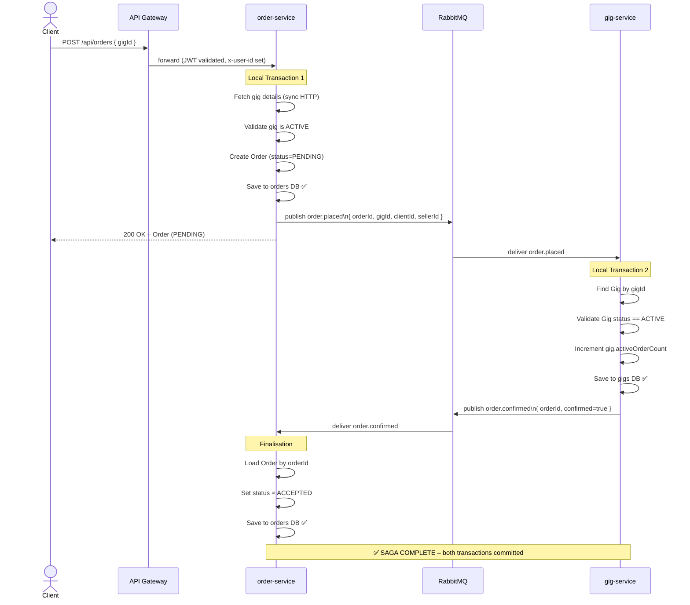
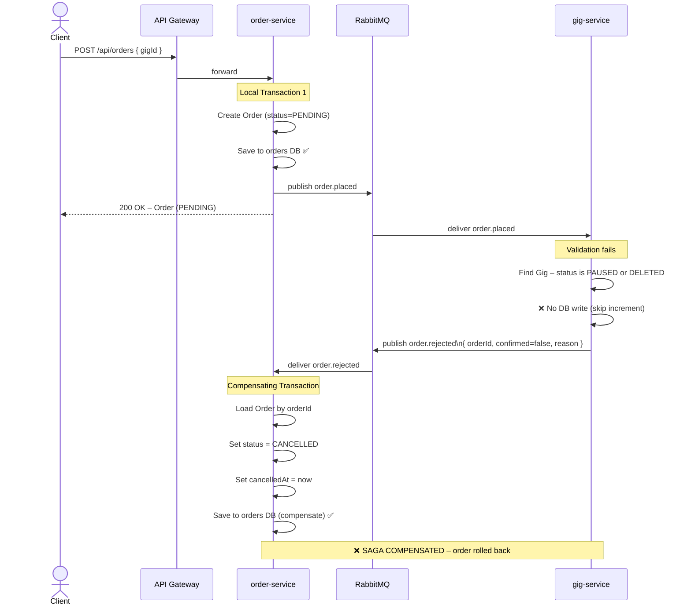

# Order Creation Saga – Choreography Pattern

## Overview

The order creation flow uses **Saga Choreography** with RabbitMQ to coordinate two local transactions across `order-service` and `gig-service`. No central orchestrator exists — each service reacts to events and publishes its own events.

### Services Involved
| Service | Local Transaction | Event Published |
|---------|------------------|-----------------|
| `order-service` | Creates `Order` (status = `PENDING`) in `orders` schema | `order.placed` |
| `gig-service` | Increments `Gig.activeOrderCount` in `gigs` schema | `order.confirmed` **or** `order.rejected` |
| `order-service` | Later moves an active order to `CANCELLED` or `COMPLETED` | `order.cancelled` or `order.completed` |
| `gig-service` | Decrements `Gig.activeOrderCount` for terminal active orders | - |
| `order-service` | Updates `Order` status → `ACCEPTED` or `CANCELLED` | – |

### RabbitMQ Topology
- **Exchange:** `skillbridge.orders` (topic)
- **Queue:** `gig.order-terminal-events` - gig-service listens, bound to routing keys `order.cancelled` and `order.completed`
- **Queue:** `gig.order-events` — gig-service listens, bound to routing key `order.placed`
- **Queue:** `order.saga-results` — order-service listens, bound to routing keys `order.confirmed` and `order.rejected`

---

## Happy Path (Gig is ACTIVE)

---

## Compensating Path (Gig is NOT ACTIVE)

---

## Key Design Decisions

| Decision | Rationale |
|----------|-----------|
| Sync HTTP call kept for gig details | order-service needs price, sellerId, deliveryTime to populate the Order record — these are data-retrieval, not coordination |
| Async RabbitMQ for saga coordination | Decouples availability confirmation; order-service is non-blocking |
| `PENDING` as intermediate state | Client gets immediate response; saga completes asynchronously |
| Manual ACK on listeners | Guarantees at-least-once delivery; failed processing requeues the message |
| Topic exchange | Allows adding more saga participants (e.g. notification-service) without changing existing code |
| Terminal active-order events | Keeps `Gig.activeOrderCount` aligned when an accepted/active order is cancelled or completed |

## Terminal Order Events

When an order moves from an active state (`ACCEPTED`, `IN_PROGRESS`, `DELIVERED`, `REVISION_REQUESTED`, or `DISPUTED`) to `CANCELLED` or `COMPLETED`, `order-service` publishes a terminal event.

`gig-service` consumes that event from `gig.order-terminal-events` and decrements `Gig.activeOrderCount`, clamping the value at zero.

`PENDING -> CANCELLED` does not publish a terminal event, because `gig-service` has not incremented `activeOrderCount` until it confirms `order.placed`.

## Compensating Actions Summary

| Failure Scenario | Compensating Action |
|-----------------|---------------------|
| Gig is PAUSED/DELETED | Order → `CANCELLED`, `cancelledAt` set, history entry added |
| Gig not found | Order → `CANCELLED` |
| gig-service internal error | Order → `CANCELLED` (error message in history note) |
| order-service listener error | Message requeued via `basicNack`, retried on next delivery |
