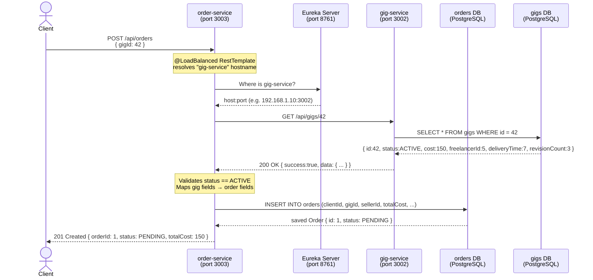
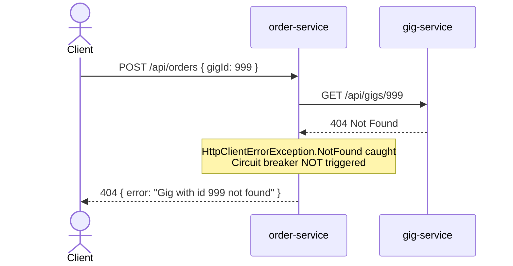
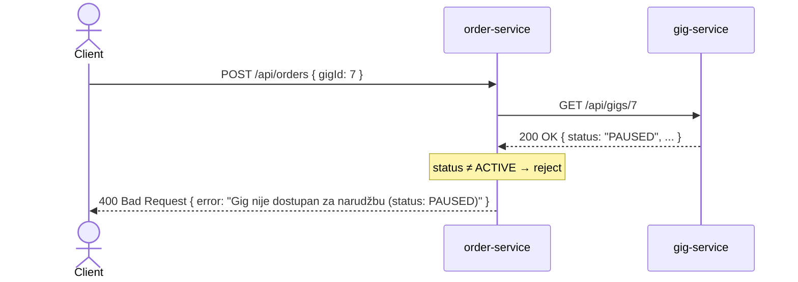
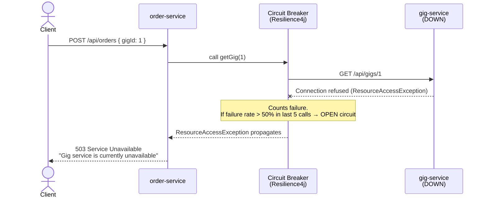
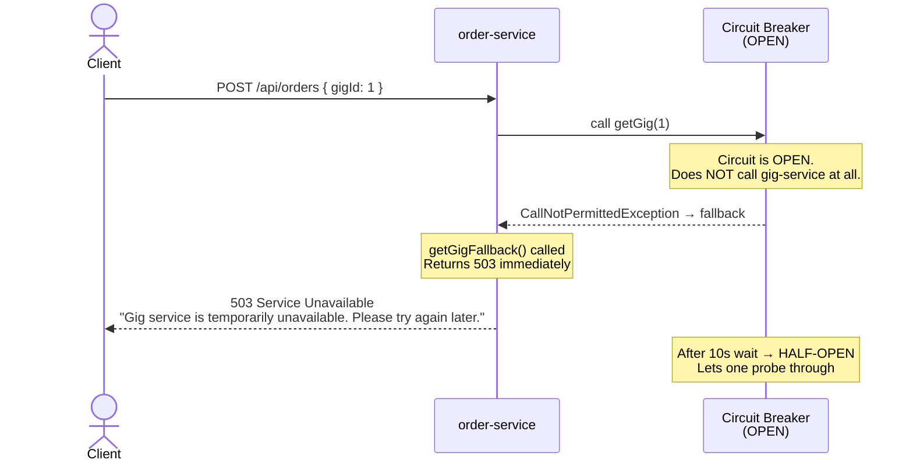
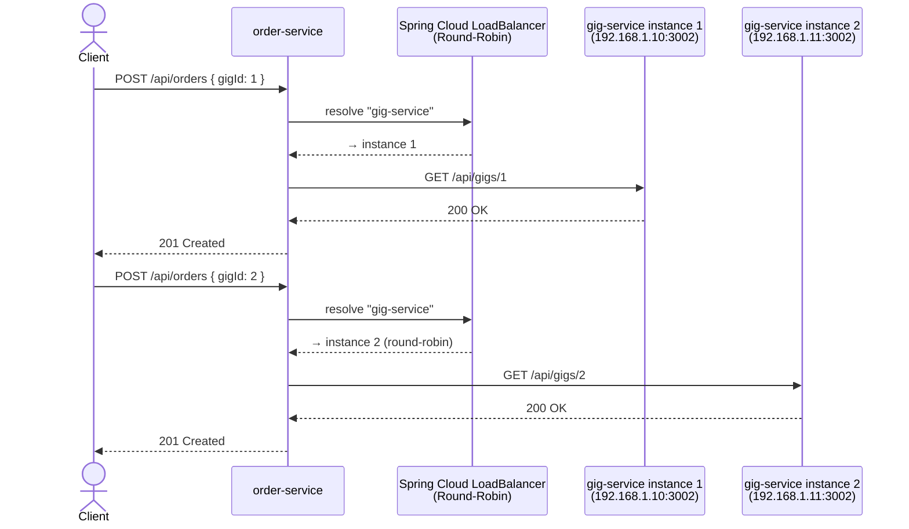

# Order-Service ↔ Gig-Service: Communication Flow Diagram

## Non-trivial synchronous communication: Create Order

**Why it is non-trivial:**  
The result depends on the state of *two* databases simultaneously:
- `gig-service` DB must contain an ACTIVE gig with a current price and seller
- `order-service` DB must not already hold a duplicate order

Price, seller ID, delivery deadline and revision count are **read from gig-service's DB**
and written into `order-service`'s DB in the same logical operation.

---

### Happy path

---

### Gig not found (404)

---

### Gig exists but is not ACTIVE (e.g. PAUSED)

---

### gig-service is DOWN — circuit CLOSED (first failures)

---

### gig-service is DOWN — circuit OPEN (fail fast)

---

### Load balancing across multiple gig-service instances

---

## Summary of design decisions

| Problem | Solution |
|---------|----------|
| Tight coupling (sync) | Circuit breaker: order-service stays up even when gig-service is down |
| Hardcoded IP/port | `@LoadBalanced` RestTemplate + Eureka service discovery |
| Slow gig-service | 3 s connect / 5 s read timeout on RestTemplate |
| Price manipulation by client | Price, sellerId, revisions fetched from gig-service — not accepted from request body |
| 404 opening circuit | `recordExceptions` includes only `ResourceAccessException` and 5xx, not 4xx |
